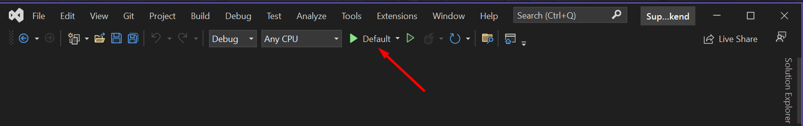

# Dependencies
All that is necessary to run the backend solution:
- [Visual Studio Community](https://visualstudio.microsoft.com/vs/community)
- [.NET 7.0](https://dotnet.microsoft.com/en-us/download/dotnet/7.0)
- [Entity Framework Tools](https://learn.microsoft.com/en-us/ef/core/get-started/overview/install#get-the-net-core-cli-tools)
- Any Relation Database
    - [ExpressSql](https://www.microsoft.com/en-us/download/details.aspx?id=104781), it was my choice
    - [MySQL](https://dev.mysql.com/downloads/installer/)
    - [SQLite](https://www.sqlite.org/download.html)
    - [SQL Server](https://www.microsoft.com/en-us/sql-server/sql-server-downloads)
    - [PostgreSQL](https://www.postgresql.org/download)

# Run Service
### Run Migration
In `SuperHeroBacked -> SuperHero.Api`
<br>
Add database connection string in `appSettings.json`

```json
"ConnectionStrings": {
    "DefaultConnection": "xpto"
  }
```

In `SuperHeroBacked -> SuperHero.Api -> Migrations`
<br>
Execute:

```
dotnet ef database update
```

<br><br>

### Configure App Settings
In `appSettings.json`
<br>
Configure:
- Port for application use on `applicationUrl`
- If you do not want to start a browser when running set `"launchBrowser": false`

```json
"profiles": {
    "Default": {
      "commandName": "Project",
      "dotnetRunMessages": true,
      "launchBrowser": true,
      "launchUrl": "swagger",
      "applicationUrl": "https://localhost:7027;http://localhost:5207",
      "environmentVariables": {
        "ASPNETCORE_ENVIRONMENT": "Development"
      }
    }
  }
```

<br><br>

### Run Application
Run the `Default` profile in Visual Studio


Or run via CLI
in folder `SuperHero.Api`
<br>
Execute:

```
dotnet run
```
