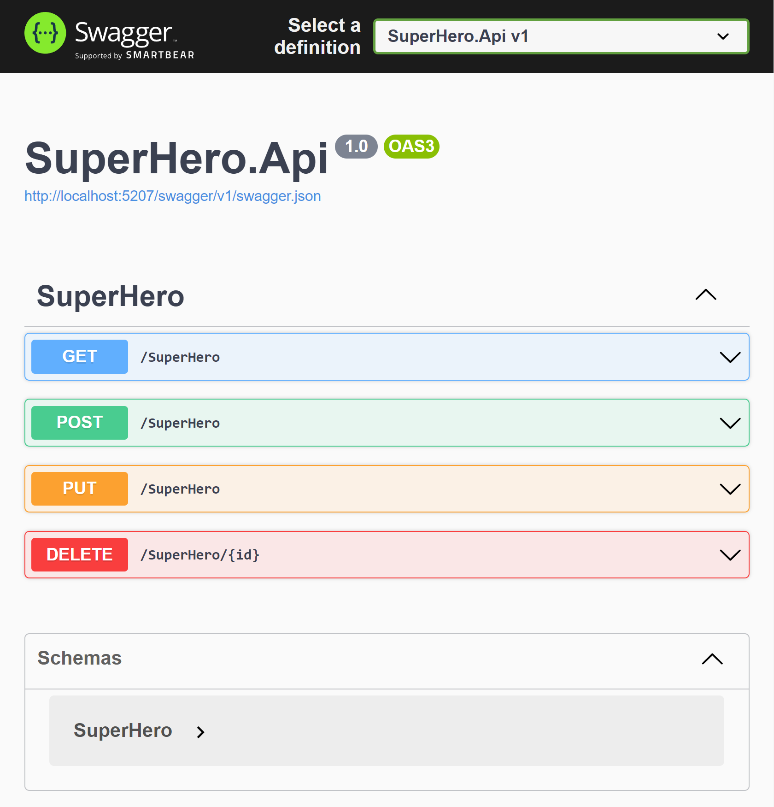
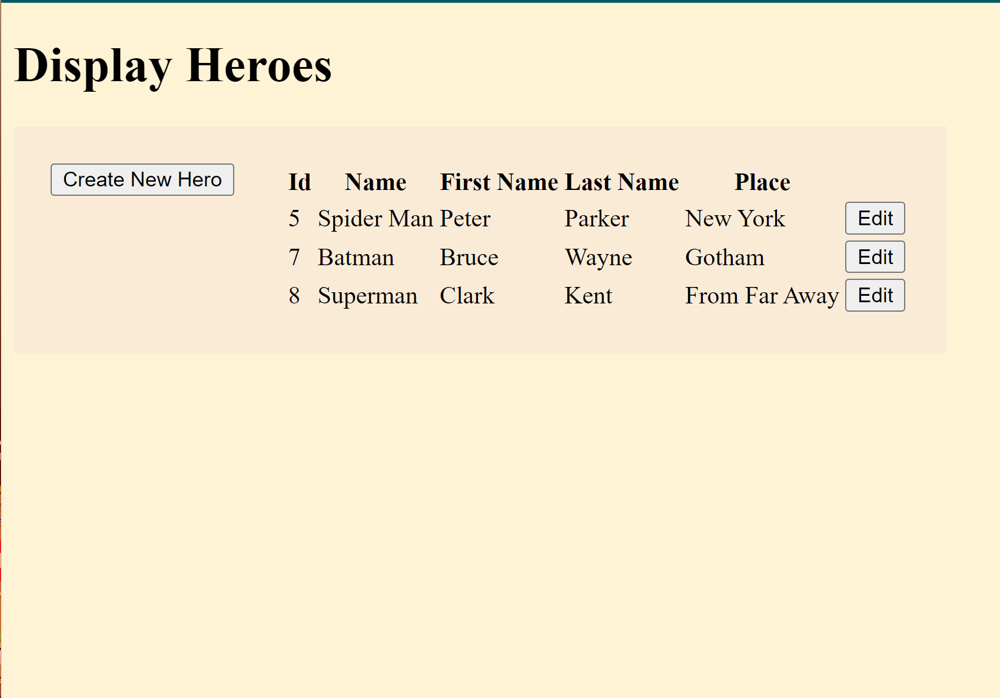
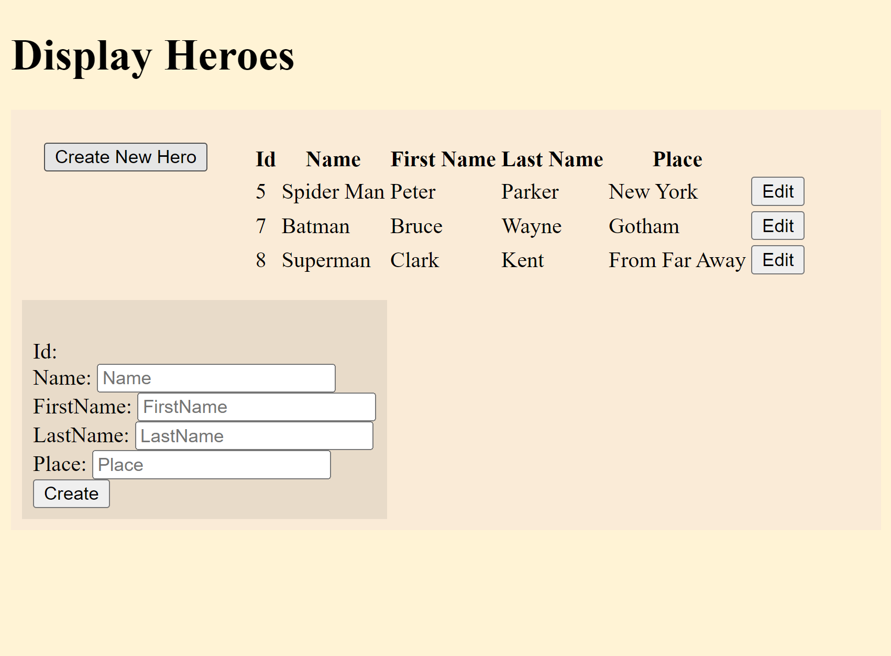
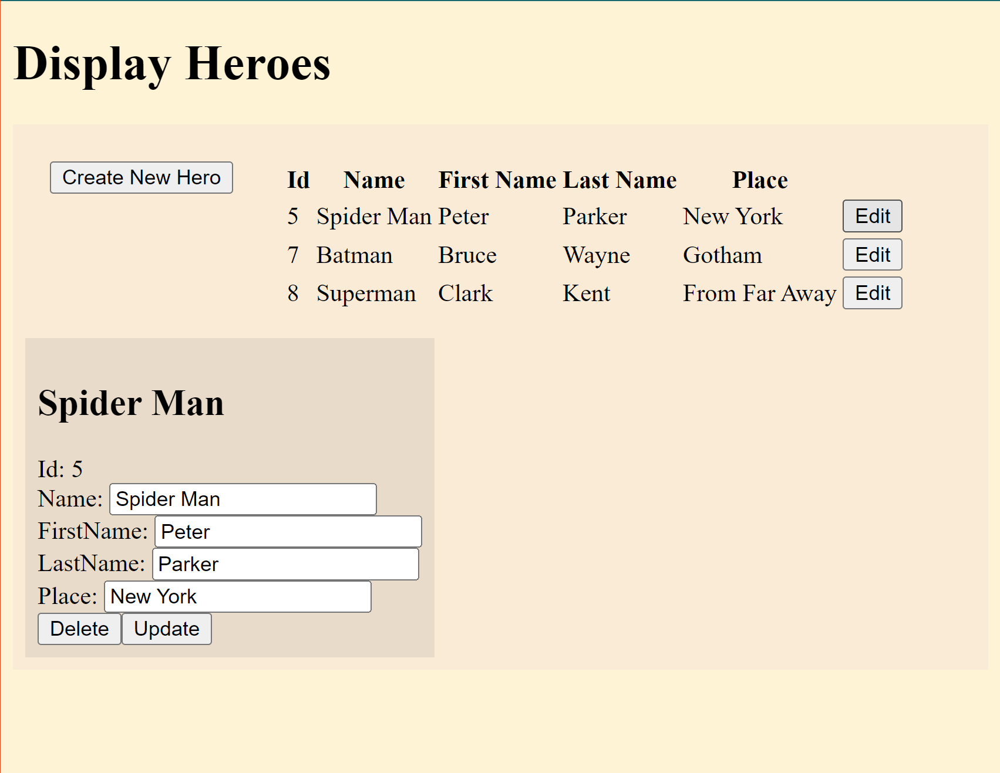

# Tech On This Project
### .NET 7
### Angular 14

# Goals
For that application the goal was have direct contact with an application made with Angular from scrath.

Initially I had a desire for write all the frontend with Angular 17, although various concepts had change from previous versions and for confort I choose to use 14 version.

# Documentation
Below there is information about dependencies, how to run.

[How to run backend](./.docs/Backend/HowToRun.md)

[How to run frontend](./.docs/Frontend/HowToRun.md)

# The project
### Swagger Page

### Initial Page

### Create New Hero Page

### Edit Hero Page

